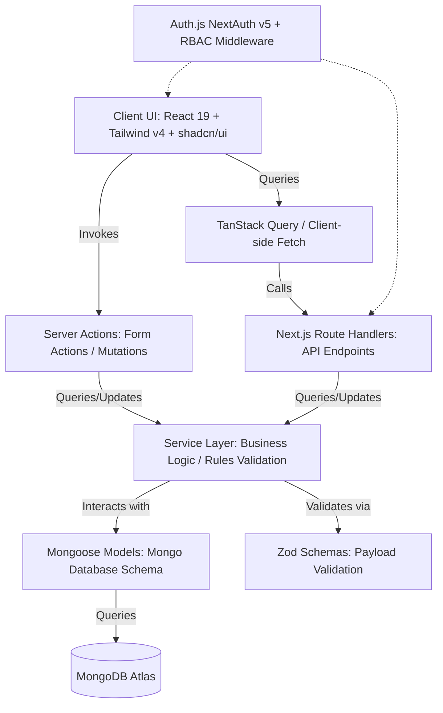
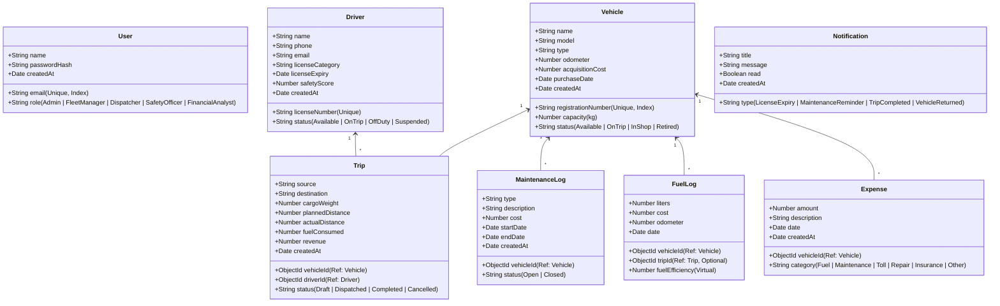

# TransitOps – Smart Transport Operations Platform
## Technical Architecture & Tech Stack Analysis
**Role:** Senior Full Stack Engineer & System Architect  
**Objective:** Define the complete architectural blueprint, tech stack alignment, schema designs, and implementation roadmap for building **TransitOps**, a production-quality Transport Management System.

---

## 1. Executive Summary & Architectural Pattern
To build a highly scalable, robust, and maintainable platform, we will adopt a **layered Next.js App Router Architecture** with clear separation of concerns (similar to the Repository/Service Pattern adapted for Server Actions and Route Handlers).



### Architectural Pillars:
- **Presentation Layer**: Built with **Next.js 16/15 (App Router)** and **React 19**, styled using **Tailwind CSS v4** and structured with **shadcn/ui**. Clean, responsive dashboards following Linear/Stripe design aesthetics (rounded cards, soft shadows, dark/light modes).
- **Security & Session Layer**: Driven by **Auth.js (NextAuth v5)** with Credentials Provider (email/password) using bcrypt password hashing. Sessions are stored in JWT format to optimize database reads. Middleware enforces Route Guarding & Role-Based Access Control (RBAC).
- **Business Logic Layer**: Enforced inside **Services** or **Server Actions**. Input validation is strictly done via **Zod** both on the frontend (React Hook Form) and backend (API boundaries).
- **Data Access Layer**: Uses **Mongoose** (ODM) connecting to **MongoDB Atlas**. Database schemas will include indexes, references, timestamps, and validation.

---

## 2. Target Tech Stack & Gap Analysis

Based on our analysis of the current workspace, here is the alignment between what is currently installed and what we must change:

| Layer | Target Tech Stack | Currently Installed | Gap / Action Required |
| :--- | :--- | :--- | :--- |
| **Framework** | Next.js 15+ (App Router), React 19 | Next.js `16.2.10`, React `19.2.4` | Keep existing Next.js 16 and React 19 as they are v19-compatible. |
| **Styling** | Tailwind CSS v4, shadcn/ui | Tailwind CSS v4, PostCSS v4 | Install shadcn/ui dependencies (`lucide-react`, `class-variance-authority`, `clsx`, `tailwind-merge`). |
| **Database** | MongoDB Atlas, Mongoose | Prisma (empty schema) | **Action**: Remove `prisma` & `@prisma/client`. Install `mongoose` & `mongodb`. |
| **Auth** | Auth.js (NextAuth v5), Credentials, JWT, RBAC | `bcryptjs`, `jsonwebtoken` (manual) | **Action**: Install `next-auth@5.0.0-beta.x` for Next.js App Router integration. |
| **State & Forms** | TanStack Query, React Hook Form, Zod | None | **Action**: Install `@tanstack/react-query`, `react-hook-form`, `@hookform/resolvers`, `zod`. |
| **Exports** | jsPDF, PapaParse | None | **Action**: Install `jspdf`, `papaparse`, `@types/papaparse`. |
| **Services** | Resend (Email), Cloudinary (Storage) | None | **Action**: Install `resend`, `cloudinary`. |
| **UI Extras** | Sonner (Toasts), Recharts (Charts) | `recharts` | **Action**: Install `sonner`. |

### Recommended Package Modifications:
We will run terminal commands to adjust the dependencies:
```bash
# Uninstall unused ORM packages
npm uninstall prisma @prisma/client

# Install required backend database, auth, and logic packages
npm install mongoose mongodb next-auth@5.0.0-beta.25 jspdf papaparse resend zod react-hook-form @hookform/resolvers @tanstack/react-query sonner lucide-react next-themes

# Install dev types
npm install -D @types/papaparse
```

---

## 3. Database Schema Design (Mongoose Models)

All database entities will use strict typing, virtuals (for calculations like Fuel Efficiency and ROI), and appropriate database indexes.



---

## 4. Codebase Directory Structure (`src` Architecture)

To keep code decoupled, clean, and testable, we will reorganize our file structure under `src/`:

```
src/
├── actions/                  # Next.js Server Actions (forms/mutations)
│   ├── vehicles.ts           # CRUD, soft delete, status transitions
│   ├── drivers.ts            # CRUD, license verification
│   ├── trips.ts              # Dispatch, complete, cancel validation
│   └── maintenance.ts        # Locking/unlocking vehicle actions
├── app/                      # Next.js App Router (Layouts, Pages, APIs)
│   ├── layout.tsx            # Global providers, Fonts, Styling
│   ├── page.tsx              # Main Landing page redirect
│   ├── login/                # Auth pages
│   ├── dashboard/            # Parent Dashboard Layout
│   │   ├── page.tsx          # Analytics, KPIs, charts
│   │   ├── vehicles/         # Vehicles CRUD interface
│   │   ├── drivers/          # Drivers CRUD interface
│   │   ├── trips/            # Trips Management interface
│   │   ├── maintenance/      # Maintenance Log interface
│   │   ├── fuel/             # Fuel logs interface
│   │   ├── expenses/         # Expense tracking interface
│   │   ├── reports/          # PDF & CSV report export
│   │   └── settings/         # Theme toggles & Profile
│   ├── api/                  # Next.js Route Handlers
│   │   ├── auth/             # next-auth endpoints
│   │   └── global-search/    # Global search route
│   └── middleware.ts         # JWT RBAC route guards
├── components/               # Reusable UI & Layout Components
│   ├── ui/                   # shadcn/ui components (buttons, dialogs, charts)
│   ├── layout/               # Sidebar, Header, Breadcrumbs
│   ├── analytics/            # Recharts wrap-ups
│   └── forms/                # Zod validated react-hook-form inputs
├── hooks/                    # Custom React hooks (useLocalStorage, etc.)
├── lib/                      # Base libraries & integrations
│   ├── db.ts                 # MongoDB/Mongoose connector (Singleton client)
│   ├── auth.ts               # NextAuth setup and RBAC options
│   └── cloudinary.ts         # Cloudinary configuration
├── models/                   # Mongoose schemas & TypeScript interfaces
│   ├── User.ts
│   ├── Vehicle.ts
│   ├── Driver.ts
│   ├── Trip.ts
│   ├── MaintenanceLog.ts
│   ├── FuelLog.ts
│   ├── Expense.ts
│   └── Notification.ts
├── types/                    # Shared TypeScript interfaces & types
└── utils/                    # Utility functions (date, currencies, validators)
```

---

## 5. Security & Business Rules Validation Flow

Security is implemented at multiple levels (Defense in Depth):

1. **Authentication Guard (Middleware)**: Checks for JWT token presence. Redirects anonymous users to `/login`.
2. **Authorization Guard (RBAC)**: Checks if `session.user.role` matches the route requirements (e.g. only Admin & Fleet Manager can edit vehicles).
3. **Payload Validation (Zod + API/Action)**: Incoming requests undergo Zod schema checks. Returns immediate validation errors if constraints fail.
4. **Business Rules Validation (Services/Actions)**:
   - **Trip Creation**: Checks if selected vehicle is `Available` (not `On Trip`, `In Shop`, or `Retired`).
   - **Driver Assignment**: Verifies driver status is `Available`, license is not expired (`licenseExpiry > Date.now()`), and status is not `Suspended`.
   - **Cargo Weight**: Ensures `cargoWeight <= vehicle.capacity`.
   - **Auto Status Shifts**:
     - *Dispatch*: Vehicle & Driver → `On Trip`.
     - *Completion*: Vehicle & Driver → `Available`.
     - *Cancellation*: Vehicle & Driver → `Available`.
     - *Maintenance Start*: Vehicle → `In Shop`.
     - *Maintenance Close*: Vehicle → `Available` (unless retired).

---

## 6. Implementation & Transition Plan

To implement the platform safely:

### Phase 1: Reconfigure Dependencies & Database Setup
- Uninstall `prisma` and install `mongoose` + other libraries.
- Initialize `lib/db.ts` with standard Next.js hot-reload safe connection logic.
- Create Mongoose models with validation and helper statics.

### Phase 2: Secure Authentication & Middleware
- Create Credentials Auth.js configuration in `lib/auth.ts` and `app/api/auth/[...nextauth]/route.ts`.
- Build the JWT decryption logic, load roles, and setup Route Guard middleware.
- Create Seed scripts to seed users (Admin, Fleet Manager, etc.) and mock data.

### Phase 3: Core CRUDs & Business Rules
- Implement Vehicle and Driver CRUD actions and API routes.
- Implement Trip Management, integrating cargo validation and driver expiry checks.
- Add Auto-transition hooks for dispatch, completion, cancellation.

### Phase 4: Maintenance, Expenses & Logs
- Build Maintenance workflow (toggles vehicle status to `In Shop`).
- Build Fuel Logs (computes fuel efficiency: `Distance / Fuel`) and Expense logging.

### Phase 5: Dashboard & Visual Reports
- Design responsive dashboards with dark/light themes.
- Render Recharts (Pie Chart, Line Chart, Bar Charts) for fleet efficiency.
- Construct the CSV/PDF exports (PapaParse, jsPDF) under Reports tab.

### Phase 6: Final Verification
- Run tests on status transitions.
- Verify global search functionality across all modules.
